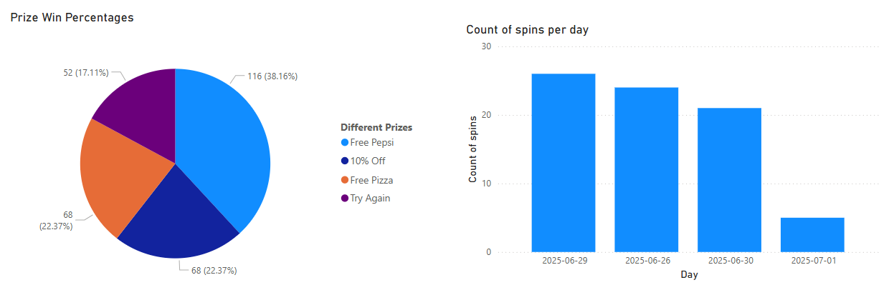

# 🎡 Roman's Pizza Spin & Win App

This is a promotional Spin-the-Wheel web app built with **Next.js**, **Tailwind CSS**, **Framer Motion**, **Express.js**, and **Supabase**. Customers can register, log in, spin to win prizes, and view their spin history. A Power BI dashboard displays spin statistics.

---

## 🚀 Features

- 🔐 Customer Registration & Login  
- 🎰 Spin Wheel with Image 
- 🏆 Prizes: Free Pizza, Free Pepsi, 10% Off, Try Again  
- ⏳ 72-hour cooldown between spins  
- 📈 Admin analytics with Power BI dashboard  
- 🎉 Animated confetti modal for prize wins  

---

## 🧩 Tech Stack

- **Frontend:** Next.js, Tailwind CSS, Framer Motion  
- **Backend:** Express.js (Node.js)  
- **Database:** Supabase (PostgreSQL)  
- **Analytics:** Power BI (via Supabase RPC functions)

---

## ⚙️ Setup Instructions

### 1. Clone the repo

```bash
git clone https://github.com/MarcoMeyer1/roman-pizza-spin-challenge.git
```

### 2. Install dependencies (Must be run inside the API and Client folder)

```bash
npm install
```

### 3. Start the backend (API)

```bash
node index.js
```

### 4. Run the frontend (Client)

```bash
npm run dev
```

---

## 📊 Power BI Dashboard

A Power BI dashboard visualizes:
- Daily spin counts
- Prize distribution
- Spin activity trends

> Screenshot:  
> 

---

## 🔌 API Endpoints

### 🔐 Auth
- `POST /api/register` – Register new customer  
- `POST /api/login` – Login customer  

### 🎡 Spin Mechanics
- `POST /api/spin` – Spin the wheel  
- `GET /api/next-spin/:customerId` – Check cooldown  
- `GET /api/history/:customerId` – Get spin history  

### 📈 Analytics
- `GET /api/spin-summary` – Prize and daily spin stats (from Supabase RPC)

---

## 🗃️ Database Schema (Supabase)

### `customers` Table
- `id` (UUID)  
- `name` (text)  
- `email` (text)  
- `password` (text – hashed)  

### `spins` Table
- `id` (UUID)  
- `customer_id` (UUID)  
- `prize` (text)  
- `spun_at` (timestamp)

---

